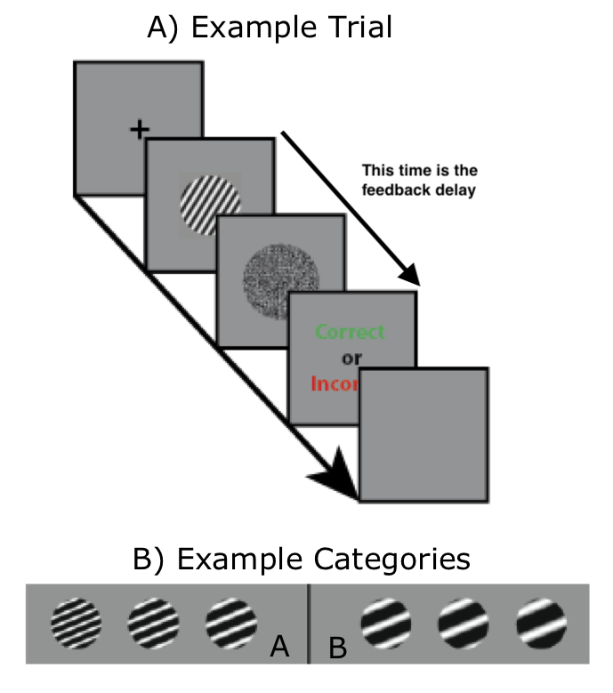

```{r setup, include=FALSE}
knitr::opts_chunk$set(echo = FALSE)
```

```{r}
library(data.table)
library(ggplot2)

rm(list=ls())
```

## 0. Begin
* Create a new file named `cogs2020_hw_2.R` and save it in
the `cogs2020` folder that you created during Lecture 1.

* If you have not already installed the `data.table`
package, do so now.

* Make the first line of your script `library(data.table)`.

* Make the second line of your script `rm(list=ls())`. This
line of code will erase any variable defined before it. Do
not put this line of code after anything important that you
want to keep (e.g., so that I can mark your work).

* After `rm(list=ls())`, create a variable named `my_name`
and set its value equal to a **character** vector (i.e.,
letters surrounded by `""` or by `''`) containing your name.

* After `rm(list=ls())`, create a variable named
`my_student_id` and set its value equal to a **character**
vector (i.e., letters surrounded by `""` or by `''`)
containing your student id.

* So far, here is what your file should look like if your
name is `John Doe` and and your student ID is `12345678`.
Note that the following code chunk also includes a few lines
to create a `data.table` named `d` that many of the problems
below require you manipulate.
```{r, echo=T}
# load data.table library
library(data.table)

# clean session
rm(list=ls())

# basic id info
my_name <- "John Doe"
my_student_id <- "12345678"

# Please include the following line of code as well
set.seed(0)

# create vectors from which to build d
V1 <- rep(month.abb[1:8], each=2)
V2 <- rep(letters[1:8], 2)
V3 <- rnorm(length(V1))

# create a data.table named d
d <- data.table(month=V1, event=V2, obs=V3)
```

Recall from lecture and tutorial that when working with
`data.frame` objects, columns can be accessed using the `$`
operator.  You may also have pushed forward on your own and
found various tutorials outlining how to use `dplyr` and
other tools in the `tidyverse` to select rows, perform
operations on columns, and group operations by other
variables. This will have lead you to lines of code using
the `%>%` operator among others. `dplyr` and the `tidyverse`
is awesome, but it isn't what we are using in this unit.
Unless explicitly instructed otherwise, please use
`data.table` syntax (i.e., `DT[i, j, by]`) to answer all
questions below.

## 1. Select rows
**a.**
Use the `data.table` keyword `.N` to report how many rows
are in `d` and store the result in a variable named
`ans_1a`.

**b.**
Return a `data.table` containing only the rows of `d` for
which `month==Jan` and store the result in a variable named
`ans_1b`.

**c.**
Return a `data.table` containing only the rows of `d` for
which `month==Feb` or `event==c` and store the result in a
variable named `ans_1c`.

**d.**
Return a `data.table` containing only the rows of `d` for
which `month==Feb` and `event==c` and store the result in a
variable named `ans_1d`.

**e.**
Using the `%in%` operator, return a `data.table` containing
only the rows of `d` for which `month` is in the vector
`c("Jan", "Mar", "May", "Jul")`,  and store the result in a variable
named `ans_1e`.


## 2. Select and operate on columns 
**a.**
Return a `vector` containing the `month` column of `d` and
store the result in a variable named `ans_2a`.

**b.**
Return a `data.table` containing only the `month` column of
`d` and store the result in a variable named `ans_2b`.

**c.**
Return a `data.table` containing only the `month` and
`event` columns of `d` and store the result in a variable
named `ans_2c`.

**d.**
Using only one line of code, return a `data.table`
containing only the `month` and `event` columns of `d`, but
renamed to `MONTH` and `EVENT`, and store the result in a
variable named `ans_2d`.

**e.** 
Return the mean `obs` across all rows in `d` and store your
result in a variable named `ans_2e`.

**f.** 
Return the mean and standard deviation of the `obs` column
across all rows in `d` and store the result in a
`data.table` named `ans_2f`. The resulting `data.table`
should have `1` observation with columns named `obs_mean` and
`obs_sd`.

## 3. Group by
**a.**
Return the mean `obs` grouped by `event` and return the
result in a `data.table` named `ans_3a`. Name the column of
`ans_3a` that contains the mean of the `obs` column
`obs_mean`.

**b.**
Return the mean `obs` grouped by `event` and grouped by
`month` and return the result in a `data.table` named
`ans_3b`. Name the column of `ans_3b` that contains the mean
of the `obs` column `obs_mean`.


## 4. [i, j, by]
**a.** Select the first 8 rows of `d` and compute the median
value of the `obs` column grouped by `month` and `event` and
return the result in a `data.table` named `ans_4a`. Name the
column of `ans_4a` that contains the median of the `obs`
column `obs_median`.


## 5. Add / remove columns, copy, etc.
**a.**
Create a variable named `d5a` using `d5a = data.table(d)`.
Create a deep copy of `d5a` named `d5a_copy` and use the
`:=` operator to add a column of zeros to `d5a_copy`. Name
the column of zeros `new_zeros`. Store the resulting
`data.table` in a variable named `ans_5a`. Be very careful
that the code you write and execute here does not modify
`d5a` or you will be marked incorrect.

**b.**
Create a variable named `d5b` using `d5b = data.table(d)`.
Create a deep copy of `d5b` named `d5b_copy` and use the
`:=` operator to remove the `obs` column from `d5b_copy`.
Store the resulting `data.table` in a variable named
`ans_5b`. Be very careful that the code you write and
execute here does not modify `d5b` or you will be marked
incorrect.

**c.**
Consider the following methods of computing the mean value
of the `obs` column in `d5c` -- see below -- grouped by
`month`.
```{r, echo=T}
d5c <- data.table(d)

# option 1
d5c_2 <- d5c[, .(obs_mean = mean(obs)), .(month)]

# option 2
d5c[, obs_mean := mean(obs), .(month)]

# option 3
d5c <- d5c[, obs_mean := mean(obs), .(month)]
```
Which option is the least efficient method of using
`data.table` ? Please store your answer as on of the
following:

* `ans_5c <- 'option 1'`
* `ans_5c <- 'option 2'`
* `ans_5c <- 'option 3'`

**d.**
Consider the following code chunk.
```{r, echo=T}
V1 <- c(1, 2, 3)
V2 <- c('a', 'b', 'c')
dd <- data.table(V1, V2)

# option 1
dd2 <- dd
dd2[, V3 := c(T, T, F)]

# option 2
dd2 <- data.table(dd)
dd2[, V3 := c(T, T, F)]

# option 3
dd2  = copy(dd)
dd2[, V3 := c(T, T, F)]
```
Which option modifies `dd`? Please store your answer
as on of the following:

* `ans_5d <- 'option 1'`
* `ans_5d <- 'option 2'`
* `ans_5d <- 'option 3'`


## 6. Real world example
Consider an experiment designed to find out whether or not
feedback-delay impairs criterion learning? What is criterion
learning? Here is an example trial:

<center>
{width=250px}
</center>

In this case, thin bars belong to category A, and thick bars
belong to category B. But where exactly is the category
boundary (i.e., criterion) that separates thick from thin?
Criterion learning is the process that allows our brains to
figure this out.   Next, you will perform a cursory analysis
on the data from this experiment.

**a.**
Use the `fread` function in the `data.table` library to read
`https://crossley.github.io/cogs2020/data/criterion_learning/crit_learn.csv`
into a `data.table` and store the result in a variable named
`ans_6a`.

The resulting `data.table` contains the following columns:

- `t`: Trial number across the entire experiment.

- `t_prob`: Trial number per problem.

- `sub`: Subject identifier (i.e., different numbers correspond to different
  subjects).

- `cnd`: Condition identifier.

- `prob_num`: Problem number (gets increased by 1 every time a participant
  solves a problem).

- `t2c`: Trials to criterion (i.e., the number of trials it took a participant
  to solve a particular problem.)

- `exp`: Experiment indicator. Overall, this study was broken down into two
  experiments -- one using sine-wave grating stimuli and the other using a
  different type of stimuli.

- `nps`: Number of problems solved. This is the same as `max(prob_num)`

**b.**
Select only rows for which `cnd=="Delay"` or for which
`cnd=="Long ITI"` and store the result in a new `data.table`
named `ans_6b`.

**c.**
Select only the columns `cnd`, `sub` and `t2c` columns and
store the result in a new `data.table` named `ans_6c`.

**d.**
Do not work on this problem until you have finished earlier
parts of the homework. When you have, start a timer on a
stop watch and then immediately work on the rest of this
problem.

Create a new `data.table` that contains the `mean` values of
the `t2c` column grouped by `cnd` and `sub`. Name the column
of mean values `t2c_mean`. Make sure that your resulting
`data.table` has only `cnd`, `sub` and `t2c_mean` columns
and nothing more (no columns named `V1` etc). Also make sure
that your resulting `data.table` only has one observation
per `sub`. Failure to do so will lead to this question being
marked incorrect.  Store the result in a variable named
`ans_6d`.

Stop the timer you started at the beginning of this problem,
and write down how long it took you to complete.

**e.** 
Do not work on this problem until you have finished earlier
parts of the homework. When you have, start a timer on a
stop watch and then immediately work on the rest of this
problem.

Download the `.csv` file at
`https://crossley.github.io/cogs2020/data/criterion_learning/crit_learn.csv`
and open it in Excel or any of your favourite spreadsheet
programs. Using this spreadsheet program, perform all of the
operations that lead to `ans_6d`.

Stop the timer you started at the beginning of this problem,
and write down how long it took you to complete.

I'm sure you see where I'm going with this. For many of us,
`R` and `data.table` will be the clear winners. Even if it
took longer, it will be clear that -- once your skill
develops -- it will be quicker and certainly more flexible
and powerful in other ways. 

On the other hand, you might be a super spreadsheet master like these people:
`https://stackoverflow.com/questions/37314049/how-to-calculate-the-means-of-100s-of-subgroups-in-excel`
If so, more power to you, but you will nevertheless need to
learn `R` in this unit. :)


## 7. Final check
A common error on these problem sets is to accidentally
erase or overwrite variables from one question with those
from another. Another common error is to name your variables
slightly wrong (e.g., `Ans_1a` instead of `ans_1a`). Yet
another common error is to include a line of code or two
that generates an error, and sometimes this error is serious
enough to prevent most or all of your script from running,
in which case you will lose most or all of your marks for
that assignment. All of these can be a very frustrating way
to lose marks, but you will indeed lose marks if you make
these mistakes, so you need to be very careful!

To ensure that this doesn't happen to you, please run your
entire `.R` script from start to finish. One way to do this
is to use `Code > Run Region > Run All`, but of course there
are shortcuts for everything so do as you wish. If there are
any errors at all when you do this, it is essential that you
address them.  

After all of your code has executed from start to finish
without and errors at all, then carefully inspect your
workspace to ensure that the following variables are
defined. A reasonable way to do this is to try to print each
one of these variables to the console. If it is defined,
then it will print without error.
```{r, eval=F, echo=T}
my_name
my_student_id
ans_1a
ans_1b
ans_1c
ans_1d
ans_1e
ans_2a
ans_2b
ans_2c
ans_2d
ans_2e
ans_2f
ans_3a
ans_3b
ans_4a
ans_5a
ans_5b
ans_5c
ans_5d
ans_6a
ans_6b
ans_6c
ans_6d
``` 