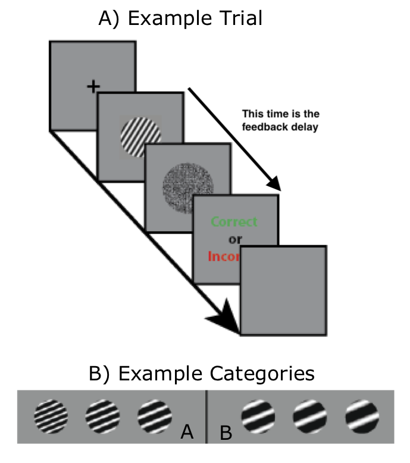

## Example with real data
Please be aware that unless you've seen a bunch of R code, this next section is
going to seem pretty confusing. Don't worry about this. Trust the process. We
will start small and go slow. We'll get there.

- **THE DEMO IS NOT COMPLETELY IN THE LECTURE NOTES SO PAY EXTRA ATTENTION**

### Welcome to the experiment! 
    
- We will discuss some behavioural data I've recently acquired in a basic
  category learning paradigm.
    
- We are hoping to answer the question: Does feedback-delay impair criterion
  learning?

- What is criterion learning? Here is an example trial.
  
<center>
{width=350px}
</center>

- In this case, thin bars belong to category A, and thick bars belong to
  category B.
  
- Bar thickness is continuous... when exactly does thick become thin? 

- Where is the category boundary, or criterion that separates
  thick from thin?
  
- Criterion learning is the process that allows us to figure this out.

- Why do we care whether or not criterion learning is impaired by feedback
  delay?

- For now, please just trust me that this is an interesting question.

### What does the data look like?
- So far, we've collected data in 5 conditions from a total 79 participants.

- Each participant generates a single csv text file.

- The first thing we have to do is wrangle all of those individual text files
  into a format that is convenient to work with.
  
- We will construct a table -- like an Excel spreadsheet -- where the $i^{th}$
  row contains information about what happened on trial $i$, and the columns
  will correspond to the various aspects of the experiment.
  
- After some magic in R, we wound up with the following:

```{r eval=TRUE, message=FALSE}
library(data.table)

rm(list=ls())

## read in an already built "data.table" of the data
## "data.table" is a type of object in R, and it is magical... you'll see.
d <- fread('data/criterion_learning/data_table/data_table_crit_learn.csv')


## Getting stray csv text files into a coherent table like this is a far larger
## portion of being a cognitive neuroscientist than is probably wise for me to
## admit. The sooner you get good at it, the better off your research career
## will become.

## In this lecture, I'll give you some demos of how to interact with
## data.tables, and how to use them to efficiently report descriptive statistics
## and make plots. I will begin teaching you how to do it yourselves in the next
## few lectures.

## the resulting data.table has the following columns:
## t: total trial number in the experiment
## t_prob: trial number within the current problem
## sub: anonymous subject ID number
## cnd: condition
## prob_num: current problm number
## t2c: number of trials it took to reach criterion for the corresponding problem
## exp: experiment number
print(d)

```

```{r eval=TRUE, message=FALSE, echo=FALSE}
d[, cnd := factor(cnd, levels=c('Delay',
                                'Long ITI',
                                'Short ITI',
                                'Delay - Binary Stim',
                                'Immediate - Binary Stim'
                                ))]
```

### Report the data
- Very roughly speaking, we can think of statistics as a mathematical tool for
  describing data using *descriptive statistics* and for making decisions on the
  basis of data using *inferential statistics*.

- Visualising the data and computing summary statistics like means and standard
  deviations are standard approaches for *descriptive statistics*.
  
- Using Null Hypothesis Significance Testing (NHST) is the standard approach for
  *inferential statistics*.

#### Report mean and sd
```{r, message=FALSE, echo=TRUE}
## Does delay increase trials to criterion
## print out the mean and standard deviation
dd <- d[, .(mean(t2c), sd(t2c)), .(cnd)]
setnames(dd, c('V1', 'V2'), c('mean', 'sd'))
print(dd)
```

#### Visualise the data
```{r eval=FALSE, message=FALSE}
library(ggplot2)

ggplot(d, aes(cnd, t2c)) +
    geom_point() +
    theme(text = element_text(size=24),
          axis.text.x = element_text(angle=30, hjust=1))

ggplot(d, aes(cnd, t2c)) +
    geom_boxplot() +
    theme(text = element_text(size=24),
          axis.text.x = element_text(angle=30, hjust=1))

ggplot(d, aes(cnd, t2c)) +
geom_violin() +
theme(text = element_text(size=24),
      axis.text.x = element_text(angle=30, hjust=1))

ggplot(d[, mean(t2c), .(cnd)], aes(cnd, V1)) +
geom_bar(stat="identity") +
theme(text = element_text(size=24),
    axis.text.x = element_text(angle=30, hjust=1))

```

<div class = "row">  
<div class = "col-md-5">
```{r, eval=TRUE, message=FALSE, echo=FALSE}
library(ggplot2)
ggplot(d, aes(cnd, t2c)) +
    geom_point() +
    theme(text = element_text(size=24),
        axis.text.x = element_text(angle=30, hjust=1)
    )
```
</div>
<div class = "col-md-5">
```{r, eval=TRUE, message=FALSE, echo=FALSE}
ggplot(d, aes(cnd, t2c)) +
    geom_boxplot() +
    theme(text = element_text(size=24),
        axis.text.x = element_text(angle=30, hjust=1)
    )
```
</div>
<div class = "col-md-5">
```{r, eval=TRUE, message=FALSE, echo=FALSE}
ggplot(d, aes(cnd, t2c)) +
    geom_violin() +
    theme(text = element_text(size=24),
        axis.text.x = element_text(angle=30, hjust=1)
    )
```
</div>
<div class = "col-md-5">
```{r, eval=TRUE, message=FALSE, echo=FALSE}
ggplot(d[, mean(t2c), .(cnd)], aes(cnd, V1)) +
    geom_bar(stat="identity") +
    theme(
        text = element_text(size=24),
        axis.text.x = element_text(angle=30, hjust=1)
    )
```
</div>
</div>


#### Null Hypothesis Significance Testing to Make a decision
- Remember, at this stage, I'm just trying to expose you to the logic of NHST.
  We will practice the logic of NHST again and again and again throughout the
  course, so please try not to panic if it seems very, very strange.

##### The fundamental logic of NHST:

1. Ask a question

2. How sure do you need to be of an answer?

3. Imagine a null universe: If the answer to your question was no, what would
   the universe look like?

4. Perform an experiment to observe the actual universe.

5. How likely is it that what you observed would have occurred in the null
   universe.

##### The fundamental logic of NHST applied to our example:

1. Ask a question
* Does feedback delay impair criterion learning?

2. How sure do you need to be of an answer?
- The standard answer for psychology is that we need to be 95% sure. 

3. Imagine a null universe: If the answer to your question was no, what would
   the universe look like?
* If feedback delay does not impair criterion learning, than learning with
   feedback delay would be just as good as learning with immediate feedback.

4. Perform an experiment to observe the actual universe.
* We already did! The results of this experiment are exactly what we have been
   looking at with all the `data.table` and `ggplot` stuff above.

5. How likely is it that what you observed would have occurred in the null
   universe.
* We don't have enough tools to answer this yet, but we can certainly use our
  intuition, and mostly, this intuition will come from visualising the data.
  
```{r eval=TRUE, message=FALSE}
library(ggplot2)
ggplot(d, aes(cnd, t2c)) +
    geom_violin() +
    theme(text = element_text(size=16),
          axis.text.x = element_text(angle=30, hjust=1))

```

##### Why is all this necessary? 
- What would happen if we ran this experiment again?
- Would the data look exactly the same?

## Install R and Rstudio
- Install R: Find the download link [here](https://www.r-project.org/)
- Install RStudio: Find the appropriate download link
    [here](https://rstudio.com/products/rstudio/)


## Where do we stand?
How confident are you that you can correctly do the following things?

0. Reproduce (from scratch and using R) the analysis I performed in lecture
1. Describe descriptive statistics
2. Describe inferential statistics
3. Describe a statistical sample
4. Describe a statistical population
5. Describe central tendency and give two examples of how it's measured
6. Describe spread and give three examples of hot it's measured
7. Describe an outlier
8. Describe how central tendency and spread influence statistical decision making
9. Define a p-value
10. Define a confidence interval?
11. Define Null Hypothesis Significance Testing
12. Give the most accurate estimate you can for the p-value

| $H_0$       | $H_1$          | Test Statistic  | p-value |
|-------------|----------------|-----------------|---------|
| $\mu = 100$ | $\mu > 100$    | $t_{14} = 2.56$ |         |
| $\mu = 100$ | $\mu < 100$    | $t_{14} = 2.56$ |         |
| $\mu = 100$ | $\mu \neq 100$ | $t_{14} = 2.56$ |         |

**DO THIS:**

1. Create a new empty .txt file
2. Jot down a number between 1 and 10 (1 for not confident at all, and 10 for
   maximum confidence) for each of the 13 questions above. Please put each
   response on a new line, and do not number your responses.
3. Send this file to me via iLearn.


## Further reading
We'll start programming R next lecture. If you are eager to get going earlier
than that, Google search is your friend. For example, DataCamp is apparently
offering free interactive tutorials to learn r
[here](https://www.datacamp.com/courses/free-introduction-to-r). Codeacademy is
offering something similar [here](https://www.codecademy.com/learn/learn-r),
though I'm not sure how free it is. There are undoubtedly many, many more
options.
